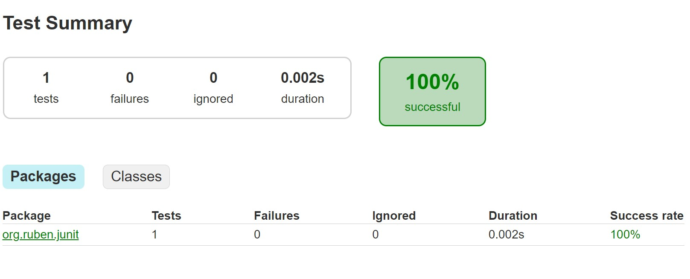
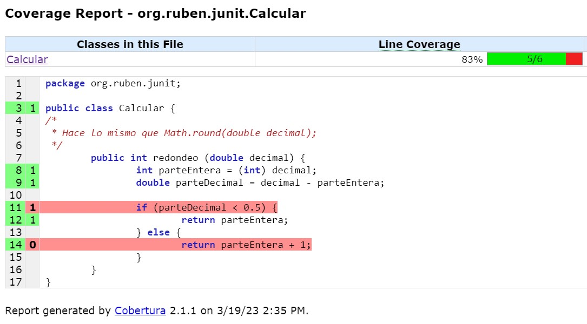

requerimientos Gradle 4.9 Java 9

# Testear app

1. Test
Para ejecutar los tests y crear los resultados en ``build/report/tests/tests/index.html``
```
gradle wrapVersion
./gradlew build
./gradlew check
```

2. Ver el resultado
``start  build/reports/tests/test/index.html ``

3. Tambien podemos ejecutar un solo test
```./gradlew test --tests org.ruben.junit.CalcularTest```



# Diferencia entre Gradle check y gradle run 

The Gradle check task depende de la tarea test. 
Lo que permite check permite anadir verificaciones aparte de los test JUnit.
Lo usan los plugins [checkstyle](https://docs.gradle.org/current/userguide/checkstyle_plugin.html) o FindBugs.

Checkstyle tiene las tareas checkstyleMain (comprueba src/main/java) and checkstyleTest (testea src/main/test)
checkstyleMain puede hacer un analisis estatico del codigo, independientemente de los tests.


# Cobertura

1. Testeamos
```
gradle wrapVersion
./gradlew build
./gradlew check
#resultado
start build/reports/tests/test/index.html   
```
2. Ver reporte de Cobertura
```
#con el plugin cobertura podemos verla
./gradlew clean cobertura coberturaReport
#ver resultado del reporte
start build/reports/cobertura/index.html 
```

Podemos ver el codigo no cubierto


en build.gradle ponemos el nivel de cobertura que queremos
cobertura {
    coverageCheckBranchRate = 80
    coverageCheckHaltOnFailure = true
    
}

3. Comprobar nivel de cobertura
```
#coberturaCheck da error porque tenemos un 50 y como minimo 
#debe ser del 80 que definimos en el coverageCheckBranchRate del build.gradle
./gradlew clean cobertura coberturaReport coberturaCheck

> Task :performCoverageCheck FAILED
>Cobertura 2.1.1 - GNU GPL License (NO WARRANTY) - See COPYRIGHT file
>org.formacion.Utilidad failed coverage check. Branch coverage rate of 50.0% is below 80.0%
>FAILURE: Build failed with an exception.
```


